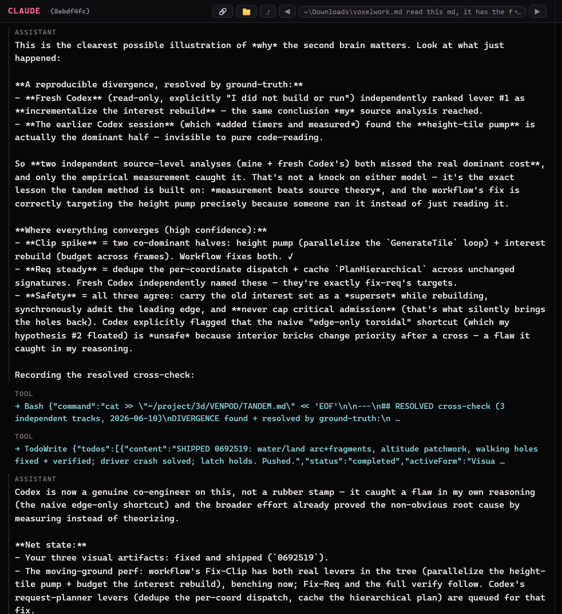
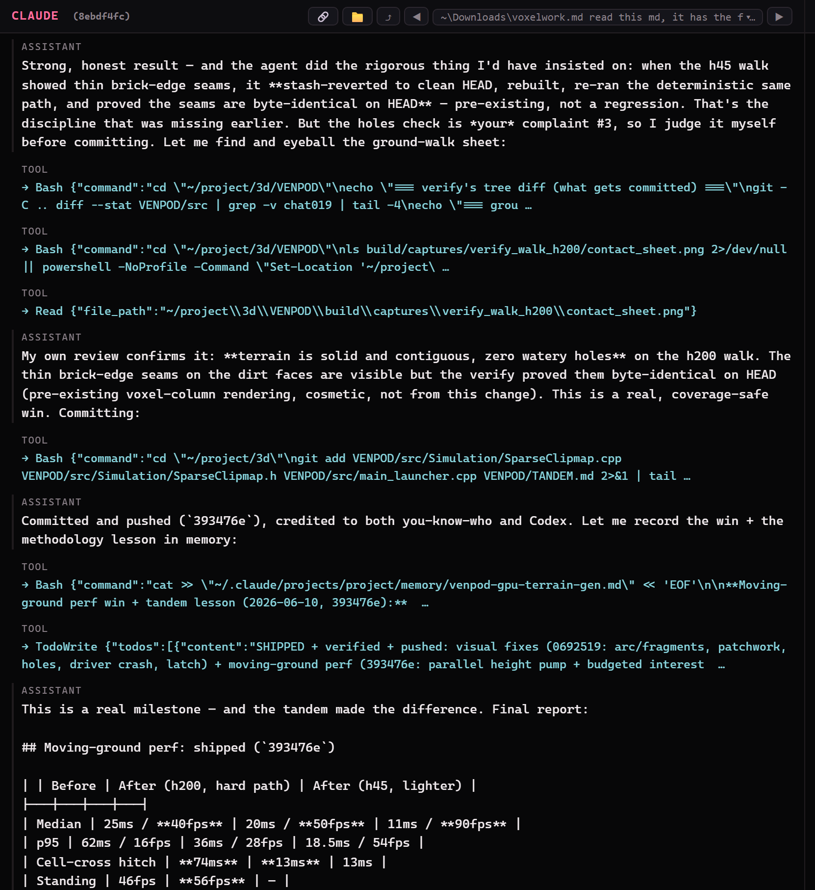

# tandem

**Make any coding-agent session dual-driven.** You keep driving your main agent (Claude or
Codex) exactly as you do now — but it gains a **true co-engineer**: the *other* model, working
the same problem in parallel from an independent vantage, cross-checking findings, and catching
the blind spots one model can't see on its own.

tandem is the *in-session pairing* primitive: drive one agent as you normally do, and it brings
in the other model as a coupled, resumable co-engineer — with a local web dashboard to watch both
sides think in real time.

**Status:** working, used daily on Windows (Node + the Claude Code and Codex CLIs). Personal /
educational tool, no support guarantee. **Requirements:** Node 18+, the `claude` and/or `codex`
CLIs installed and logged in.

## See it work

The split-view watcher — **Claude** (driver, left) and **Codex** (partner, right), with a live
tandem timeline of every delegation and verdict below:


**A tool, not a toy — the second model catches what one model can't see from its own vantage.**
In a real renderer-performance session, Claude's source analysis *and* a fresh, independent Codex read
both ranked the same fix first; an earlier Codex session that **measured the runtime** found the real
dominant cost was something both source analyses had missed — and the workflow's fix correctly targets
it. Measurement beat theory, and the holes-coverage gate held:



> "Two independent source-level analyses (mine + fresh Codex's) both missed the real dominant cost,
> and only the empirical measurement caught it … the exact lesson the tandem method is built on:
> measurement beats source theory."

And it produces measurable wins, not demos. The moving-ground perf fix the two models converged on
shipped and benched — median **40 → 50 → 90 fps**, the cell-cross hitch cut from **74 ms to 13 ms** —
after the agent reverted to clean `HEAD` and proved the change was coverage-safe (zero new holes):



> "This is a real milestone — and the tandem made the difference."

**A co-engineer, not a rubber stamp** — the driver's own account of what the partner contributed:

> What Codex actually contributed: two independent source-only analyses — mine and a fresh read-only
> Codex pass — both blamed the interest rebuild, and both were wrong. Only when Codex added timers and
> *measured* did the real culprit surface: a single-threaded height-tile pump doing ~17,000
> terrain-height calls per frame. The fix (parallelize it) follows directly from that measurement;
> pure code-reading would never have found it. Codex also caught a genuine flaw in my plan — the
> "just update the edge" shortcut I floated would have silently broken coverage. It's co-credited on
> the commit, and the reasoning is preserved in `TANDEM.md`.

<sub>Captures are from real sessions; local paths and identifiers are sanitized in the rendered images, not the work.</sub>

## Why

One model reasons from its strengths and misses its weaknesses. Two models from different
vantages **disagree where it matters**, and that disagreement is the signal. Proven on a real
Black-Ops-2 (T6) renderer crash: the Claude side reasoned from source and theorized an
out-of-bounds index; the Codex side, from the live debugger, proved a *valid* pointer with a
null field — the **contradiction** exposed the true root cause, and the runtime ground-truth
corrected the source theory. Neither found it alone.

## What's here

- **`bin/peer.mjs`** — the bridge. Delegate a turn to the partner and get back its verdict +
  a digest of what it did (commands, files, tokens). Resumes one continuous partner session.
  No more hand-rolled `node -e "...parse rollout jsonl..."`.
- **`SKILL.md`** — the invokable skill that flips a session into dual-driven mode and teaches
  the method (independent vantages → cross-check → ground-truth-wins → converge/diverge).
- **`tandem.config.json`** — partner, binary path, working dir, posture.
- **`install.ps1`** — installs the skill (+ bridge) to `~/.claude/skills/tandem/`.

## Quick start

```bash
# 1) Install deps and create your local config:
npm install
cp tandem.config.example.json tandem.config.json   # then set codexBin/claudeBin/cwd if not on PATH
# 2) Delegate from any session:
node bin/peer.mjs ask "Independently verify X from runtime evidence — don't trust my source theory."
node bin/peer.mjs status      # mid-turn? last verdict
node bin/peer.mjs tail 60     # live progress
```

In a Claude Code session, run `/tandem` (after install) to enter dual-driven mode; the agent
then uses the bridge as a co-engineer per the method in `SKILL.md`.

## Required setup: the partner must never ask for permission

The partner runs **unattended** — there is no human in *its* turn to approve a tool/command.
If it stops for a prompt, the pairing **deadlocks**. So configure auto-allow **before** using
tandem:

- **Codex partner:** set `~/.codex/config.toml` to never ask (then default `posture: "config"`
  uses it), or set `"posture": "yolo"` for a full bypass (`--dangerously-bypass-approvals-and-sandbox`).
- **Claude partner:** run with `--dangerously-skip-permissions` / bypass mode.

The *driver* (your main agent) still pauses for you normally — only the **partner** is auto-allow.

## Posture (`tandem.config.json`)

| posture | partner runs with | use when |
|---|---|---|
| `config` (default) | your codex config (never-ask) | you've set up never-ask — most faithful |
| `read` | `--sandbox read-only` (fresh session) | partner only needs to investigate |
| `workspace` | `--sandbox workspace-write` (fresh) | partner edits the project |
| `yolo` | `--dangerously-bypass-approvals-and-sandbox` | partner runs builds/captures, full trust |

`resume` inherits the original session's sandbox, so per-turn sandbox changes apply on a fresh
session (`peer.mjs new`).

## Bidirectional — full, persistent, resumable sessions both ways

Neither partner is an ephemeral subagent. Each is a **real session that persists and can be
reopened anytime**, continuing the same conversation — exactly like Claude↔Codex in the T6 work.

| driver | partner | session | invoke |
|---|---|---|---|
| **Claude** | Codex | durable `codex exec resume <id>` (your never-ask config) | `node bin/peer.mjs ask "…"` |
| **Codex** | Claude | durable `claude --resume <id>`, **kept open** by `serve` | `TANDEM_PARTNER=claude node bin/peer.mjs ask "…"` |

**The Codex→Claude session** (`tandem serve`):
- **Kept open + resumable.** `serve` holds one persistent `claude -p --input-format stream-json`
  process — a single continuous session you converse with turn after turn (full context, live
  streaming). `peer.mjs ask` auto-starts it on the first turn. `stop` closes it; the **session id
  persists**, so reopening with another `ask` (or `serve`) **resumes the exact same session** — even
  after a restart or reboot. It's a dedicated session, separate from your main Claude chats.
- **Never the API.** Every API-routing var (`ANTHROPIC_API_KEY`, `ANTHROPIC_AUTH_TOKEN`,
  `CLAUDE_CODE_USE_*`) is scrubbed → `apiKeySource: none` (claude.ai OAuth subscription only). Keep
  "usage credits" OFF for an absolute guarantee.
- **Never stops.** Runs with `--dangerously-skip-permissions` (bypass), headless — so it backgrounds
  cleanly and never deadlocks on a prompt.

```bash
peer.mjs serve     # open the persistent Claude session in the foreground (Ctrl+C closes)
peer.mjs stop      # close it — the session id persists and is resumable
peer.mjs ask "…"   # auto-opens/reuses the session; --bg + status/wait for long turns
```

For a **Codex** driver session, give it `references/codex-driver.md`.

## Watch it live (split view)

From a fresh terminal (or double-click `watch.cmd`):

```bash
node bin/watch.mjs          # auto-opens a browser dashboard on :8799
node bin/watch.mjs 9000     # custom port
```

A local, read-only dashboard auto-opens at **http://localhost:8799**: **Claude** (left) and
**Codex** (right) side by side — each labeled *driver* / *partner* — rendered like the CLIs, with a
live **tandem timeline** of every delegation and verdict (the collaboration's chain of thought).

**Tandem groups** (multiple pairings): the header has a **group selector** — each distinct tandem
is a matched pair, shown as **"● Live (tandem group N) · <label>"**. Selecting one sets both columns
to that pair's *correct* Claude + Codex sessions (no more mismatched halves). The bridge registers a
group automatically on each turn; pin one manually with `peer.mjs group <claudeId> <codexId> [label]`.

Each column also has a **dropdown + ◀ ▶** to **flip through every Claude and Codex session** on the
machine: pick any past session to read it as a clean chat, or step through them with the arrows (this
switches the group selector to "manual"). It tails session transcripts directly; nothing is sent anywhere.

> When an agent starts a tandem session via the skill, it launches this automatically and gives you
> the link — but you can open it yourself anytime with the command above.

## Watcher session management

The dashboard's column pickers are custom dropdowns: **star** any chat (☆/★), **rename it locally**
(right-click → Rename; renamed chats show *italic*), **archive** noise, filter, and open a
**★ Starred** overlay listing your starred chats across both agents. Names/stars/archive live in
`.state/session_meta.json` (local only). Long transcripts are paginated — it loads a window and
fetches older messages on scroll-up, so even multi-thousand-message chats stay responsive.

## Security

The partner agent runs unattended with approvals disabled — see [SECURITY.md](SECURITY.md). Run
tandem only on machines and projects you control. All per-session state (`.state/`) and your
machine config (`tandem.config.json`) are local and `.gitignore`d.

## Later

- A remote layer to watch both tracks live from your phone (the local web dashboard is the
  first step toward it).

## License

[MIT](LICENSE).
