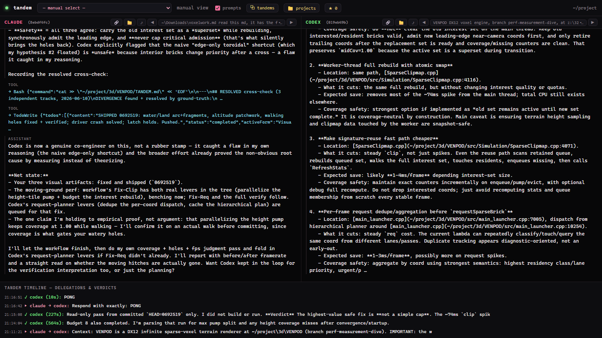

# tandem

**Make any coding-agent session dual-driven.** You drive your main agent (Claude or Codex) as
usual; it pulls in the *other* model as a real co-engineer — working the same problem from an
independent vantage, cross-checking your findings, and catching the blind spots one model can't
see on its own. The partner is a coupled, resumable session, and a local dashboard lets you watch
both sides think in real time.

**Status:** working; used daily on Windows (Node + the Claude Code and Codex CLIs). A personal,
educational tool with no support guarantee. **Requirements:** Node 18+ and the `claude` and/or
`codex` CLIs, installed and logged in.

## See it work

The split-view watcher: **Claude** (driver, left) and **Codex** (partner, right), with a live
timeline of every hand-off and verdict below.



**One real session, one concrete result.** Debugging a renderer's frame rate, Claude's source
analysis and an independent Codex read both ranked the same fix first — but a third Codex pass that
actually *measured the runtime* caught the real dominant cost both source reads had missed. The fix
the two models converged on shipped and benched: median **40 → 90 fps**, frame hitch
**74 ms → 13 ms**, verified against a clean baseline. Later in the same session the two models
independently found *different, complementary* bugs — each surfaced one the other had walked past.
That is the whole point: two independent reads, a real disagreement, and ground-truth settling it.

<sub>Captures are from real sessions; local paths and identifiers are sanitized in the images, not the work.</sub>

## Why

One model reasons from its strengths and misses its weaknesses. Two models, working from different
vantages, **disagree where it matters** — and that disagreement is the signal. In a real crash deep
in a large game engine, the Claude side reasoned from the source and theorized an out-of-bounds
index; the Codex side, reading the live debugger, found a *valid* pointer with a null field. The
**contradiction** is what exposed the true cause: the runtime evidence corrected the source theory,
and neither side would have found it alone.

## What's here

- **`bin/peer.mjs`** — the bridge. Delegate a turn to the partner and get back its verdict plus
  a digest of what it did (commands, files, tokens). It resumes one continuous partner session,
  so you never hand-parse session logs.
- **`SKILL.md`** — the invokable skill that flips a session into dual-driven mode and teaches
  the method (independent vantages → cross-check → ground-truth-wins → converge/diverge).
- **`tandem.config.json`** — partner, binary path, working dir, posture.
- **`install.ps1`** — installs the skill (+ bridge) to `~/.claude/skills/tandem/`.

## Quick start

```bash
# 1) Install deps and create your local config:
npm install
cp tandem.config.example.json tandem.config.json   # then set codexBin/claudeBin/cwd if not on PATH
# 2) Delegate from any session:
node bin/peer.mjs ask "Independently verify X from runtime evidence — don't trust my source theory."
node bin/peer.mjs status      # mid-turn? last verdict
node bin/peer.mjs tail 60     # live progress
```

In a Claude Code session, run `/tandem` (after install) to enter dual-driven mode; the agent
then uses the bridge as a co-engineer per the method in `SKILL.md`.

## Required setup: the partner must never ask for permission

The partner runs **unattended** — there is no human in *its* turn to approve a tool/command.
If it stops for a prompt, the pairing **deadlocks**. So configure auto-allow **before** using
tandem:

- **Codex partner:** set `~/.codex/config.toml` to never ask (then default `posture: "config"`
  uses it), or set `"posture": "yolo"` for a full bypass (`--dangerously-bypass-approvals-and-sandbox`).
- **Claude partner:** run with `--dangerously-skip-permissions` / bypass mode.

The *driver* (your main agent) still pauses for you normally — only the **partner** is auto-allow.

## Posture (`tandem.config.json`)

| posture | partner runs with | use when |
|---|---|---|
| `config` (default) | your codex config (never-ask) | you've set up never-ask — most faithful |
| `read` | `--sandbox read-only` (fresh session) | partner only needs to investigate |
| `workspace` | `--sandbox workspace-write` (fresh) | partner edits the project |
| `yolo` | `--dangerously-bypass-approvals-and-sandbox` | partner runs builds/captures, full trust |

`resume` inherits the original session's sandbox, so per-turn sandbox changes apply on a fresh
session (`peer.mjs new`).

## Bidirectional — full, persistent, resumable sessions both ways

Neither partner is an ephemeral subagent. Each is a **real session that persists and can be
reopened anytime**, continuing the same conversation across turns, restarts, and reboots.

| driver | partner | session | invoke |
|---|---|---|---|
| **Claude** | Codex | durable `codex exec resume <id>` (your never-ask config) | `node bin/peer.mjs ask "…"` |
| **Codex** | Claude | durable `claude --resume <id>`, **kept open** by `serve` | `TANDEM_PARTNER=claude node bin/peer.mjs ask "…"` |

**The Codex→Claude session** (`tandem serve`):
- **Kept open + resumable.** `serve` holds one persistent `claude -p --input-format stream-json`
  process — a single continuous session you converse with turn after turn (full context, live
  streaming). `peer.mjs ask` auto-starts it on the first turn. `stop` closes it; the **session id
  persists**, so reopening with another `ask` (or `serve`) **resumes the exact same session** — even
  after a restart or reboot. It's a dedicated session, separate from your main Claude chats.
- **Never the API.** Every API-routing var (`ANTHROPIC_API_KEY`, `ANTHROPIC_AUTH_TOKEN`,
  `CLAUDE_CODE_USE_*`) is scrubbed → `apiKeySource: none` (claude.ai OAuth subscription only). Keep
  "usage credits" OFF for an absolute guarantee.
- **Never stops.** Runs with `--dangerously-skip-permissions` (bypass), headless — so it backgrounds
  cleanly and never deadlocks on a prompt.

```bash
peer.mjs serve     # open the persistent Claude session in the foreground (Ctrl+C closes)
peer.mjs stop      # close it — the session id persists and is resumable
peer.mjs ask "…"   # auto-opens/reuses the session; --bg + status/wait for long turns
```

For a **Codex** driver session, give it `references/codex-driver.md`.

## Watch it live (split view)

From a fresh terminal (or double-click `watch.cmd`):

```bash
node bin/watch.mjs          # auto-opens a browser dashboard on :8799
node bin/watch.mjs 9000     # custom port
```

A local, read-only dashboard auto-opens at **http://localhost:8799**: **Claude** (left) and
**Codex** (right) side by side — each labeled *driver* / *partner* — rendered like the CLIs, with a
live **tandem timeline** of every delegation and verdict (the collaboration's chain of thought).

**Tandem groups** (multiple pairings): the header has a **group selector** — each distinct tandem
is a matched pair, shown as **"● Live (tandem group N) · <label>"**. Selecting one sets both columns
to that pair's *correct* Claude + Codex sessions (no more mismatched halves). The bridge registers a
group automatically on each turn; pin one manually with `peer.mjs group <claudeId> <codexId> [label]`.

Each column also has a **dropdown + ◀ ▶** to **flip through every Claude and Codex session** on the
machine: pick any past session to read it as a clean chat, or step through them with the arrows (this
switches the group selector to "manual"). It tails session transcripts directly; nothing is sent anywhere.

> When an agent starts a tandem session via the skill, it launches this automatically and gives you
> the link — but you can open it yourself anytime with the command above.

## Watcher session management

The dashboard's column pickers are custom dropdowns: **star** any chat (☆/★), **rename it locally**
(right-click → Rename; renamed chats show *italic*), **archive** noise, filter, and open a
**★ Starred** overlay listing your starred chats across both agents. Names/stars/archive live in
`.state/session_meta.json` (local only). Long transcripts are paginated — it loads a window and
fetches older messages on scroll-up, so even multi-thousand-message chats stay responsive.

## Compaction — neither model breaks at max context

A long pairing eventually fills the partner's context window. Instead of letting it break, tandem
hands the work off to a fresh thread that carries a summary forward — and the driver stays in control:

- **You're notified when the passenger runs low.** After any turn whose context passes
  `compactAtTokens` (default 300k — set it near ~80% of the partner model's window), `ask` and
  `status` print a notice.
- **You craft the handoff.** Run `peer.mjs compact "Summarize X, Y, Z so a fresh session continues"`.
  The partner summarizes with *your* prompt, a fresh session is seeded with that summary, and the pair
  re-couples to it automatically. Omit the prompt for a sensible default.
- **Safety net.** If a turn still hits the wall, the bridge recovers on a fresh session seeded with a
  best-effort summary instead of failing.
- Set `"autoCompact": true` to compact automatically (with the default summary) instead of being asked.

It works both directions: the Codex partner hands off via a fresh `codex exec`; the Claude partner (the
`serve` daemon) closes and reopens a fresh session seeded with the summary.

## Security

The partner agent runs unattended with approvals disabled — see [SECURITY.md](SECURITY.md). Run
tandem only on machines and projects you control. All per-session state (`.state/`) and your
machine config (`tandem.config.json`) are local and `.gitignore`d.

## Later

- A remote layer to watch both tracks live from your phone (the local web dashboard is the
  first step toward it).

## License

[MIT](LICENSE).
